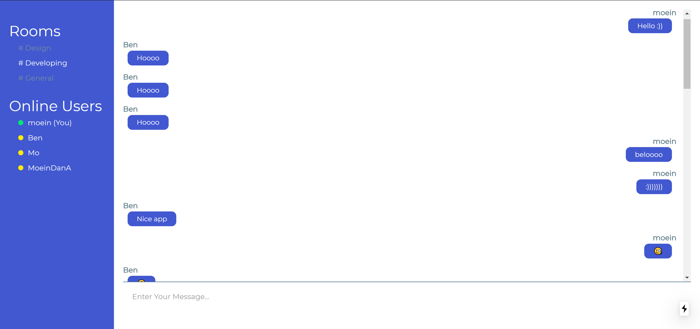
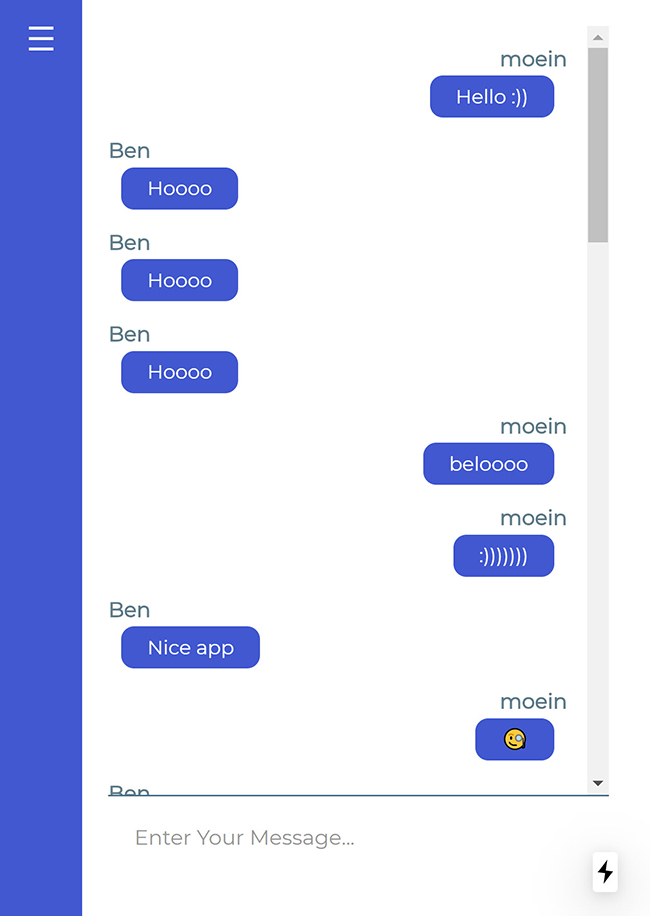

# Ciao Chat
[![Star on GitHub][github-star-badge]][github-star]

[github-star-badge]: https://img.shields.io/github/stars/moeindanesh/ChatApp.svg?style=social
[github-star]: https://github.com/moeindanesh/ChatApp/stargazers


**Simple Cool Chat Application with ReactJs (nextJs) and NodeJs**


- Support Multiple Rooms
- Show Online Users in Each Room
- Typing Indicator
- Auto Scroll on New Message
- Responsive Design UI
- Easy Configuration





## Getting Started

To get started, download the CiaoChat then run `npm install`:

```
git clone https://github.com/moeindanesh/ChatApp.git
cd ChatApp
npm install
```

## Create ChatKit Instance

To create ChatKit instance go to [pusher.com](https://pusher.com/chatkit) and head to dashboard
Hit Create New from ChatKit section

## Ciao Chat Configuration
Note Down Instance Locator and Secret Key in the CREDENTIALS tab from pusher website
Then Update config.js file

```
module.exports = {
    INSTANCE_LOCATOR: 'YOUR INSTANCE LOCATOR',
    KEY: 'YOUR SECRET KEY',
    SERVER: 'SERVER ADDRESS',
    DEFAULT_ROOM: 'DEFAULT ROOM'
}
```


